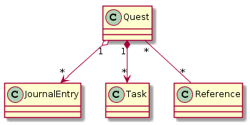

# Description

Little angular SPA intended to try some of the library-features of PouchDB within a restricted set of application-features.
The application-features I want to try are:
* Data modelling approaches with a document oriented database for some special problem.
* Join of dependent data models through views of Couch/PouchDB.
* Indices through design documents: sorting and filtering by multiple criteria (sort of).
* Pouch <--> Couch synchronization and conflict management.
* Maybe storage size limit testing.

# Task planning

* [DONE] Simple master-detail view with Create and Show
* [DONE] Add Edit and Delete.
* [DONE] Write a journal inside the quest.
* [DONE] References & attachments.
* [NEXT] Sync with CouchDB server (or similar) back and forth.
* [TODO] Show all journal entries by date despite of which quest contains them.

# Model

The problem is interesting because it has an inlined 1:N relationship, a shared 1:N relationship and an N:M relationship, so it moreover covers any building block of data modelling with PouchDB.